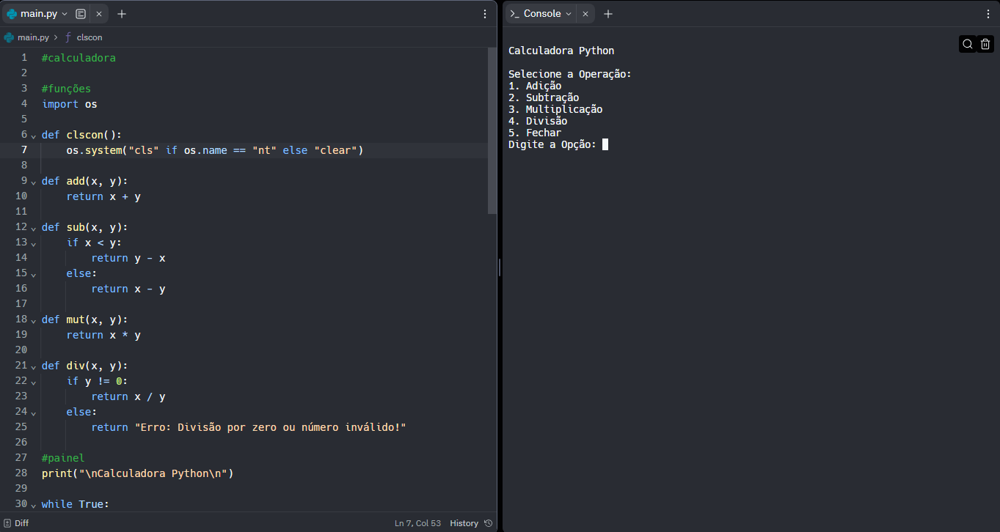

<h1 align="center">Calculadora</h1>

 

 

# Tecnologias
Este projeto foi desenvolvido utilizando:
    
          
 
 

# Status do projeto
Finalizado (Versão Desktop)

 

# Inspiração
Esta página de destino foi desenvolvida com o propósito de aprimorar meus conhecimentos em HTML/CSS.

 

